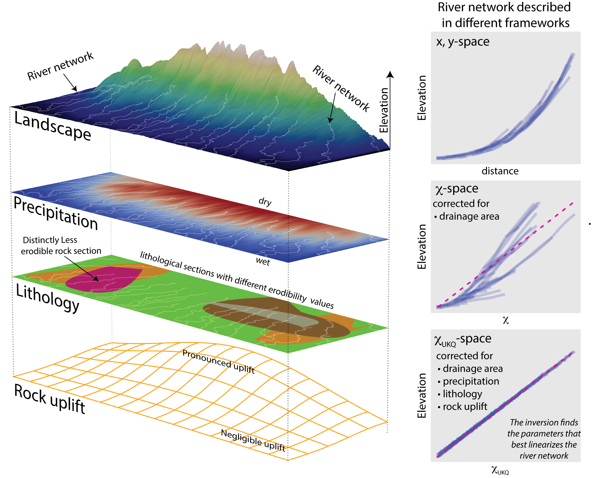

#  χ-Space Inversion for Detachment-Limited Landscapes Inversion for Detachment-Limited Landscapes

<p align="center">
  
</p>

<p align="center">
  <em> Overview of the χ-Space inversion workflow for detachment-limited landscapes.</em>
</p>

This repository contains the codebase for performing inversions of detachment-limited landscapes in chi space. 

The methods are documented in:

**Oryan et al. (2025)**  
https://doi.org/10.1029/2024JB030819

## Installation

This code requires `numba`, `daggerpy`, `pyscabbard`, `numpy`, `matplotlib`, `xarray`,  `seaborn` among other packages

We highly recommend installing the code in a clean Conda environment:

```bash
export PYTHONNOUSERSITE=1
unset PYTHONPATH

conda create -n invertchi -c conda-forge python=3.11 xtensor-python pip
conda activate invertchi

pip install taichi
pip install numba
pip install daggerpy
pip install pyscabbard
pip install numpy matplotlib xarray seaborn
pip install "setuptools<81" --force-reinstall 
pip install ipykernel #  if you want to use jupyter notebook
pip install ipympl # useful for interactive figuers within your notebook
```

<sub>Tested with Python `3.11.15`.</sub>

## Usage

Example workflows are slowly been added to the `examples/` directory.

A recommended starting point is:

```text
examples/prepare_dem.ipynb
examples/chi_space_inversion.ipynb
```

## Citation

If you use this package, please cite:

**Oryan et al. (2025)**  
https://doi.org/10.1029/2024JB030819

## Disclaimer

This repository was originally developed as personal research code and some parts may still be less user-friendly than a  polished software package. Also occasional glitches are expected.

This is a work in progress. If you run into problems, please open an issue so they can be tracked and addressed.